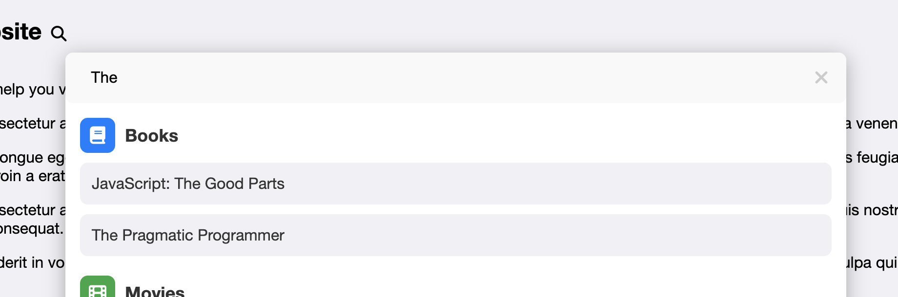
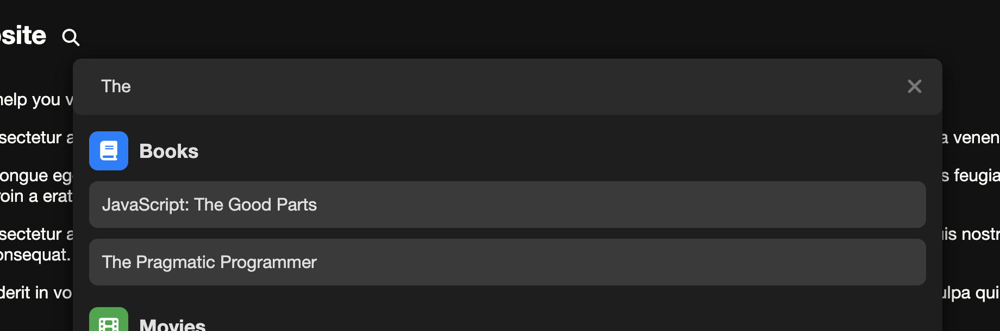

# 🔍 Spotlight Search

The Spotlight Search is a customizable JavaScript module that provides a quick search functionality with a spotlight-style modal. It supports categories with custom icons and colors, integrates with a data source via AJAX, and allows customization through options and callbacks. The module is built with a focus on flexibility and ease of integration.




## 🚀 Features

- **Native**: Implemented entirely with vanilla JavaScript and CSS for high performance and simplicity.
- **Customizable**: Easily customize icons, colors, styles and behaviors to fit your design needs.
- **Debounced Input**: Minimizes unnecessary requests with built-in debounce functionality.
- **Dynamic Results**: Automatically updates search results with asynchronous data fetching.
- **Keyboard Shortcuts**: Quick access to the spotlight search with customizable keyboard shortcuts.
- **Dark Mode Support**: Includes options for dark mode to enhance usability in low-light environments.

## 📦 Installation

1. Clone the repository or download the files.
2. Include the JavaScript and CSS files in your project.

### Files

- `spotlight.js`: The main JavaScript module.
- `spotlight.css`: The accompanying CSS file for styling the modal.

### Example

- `example.html`: A working example of using the module.

## 📚 Usage

### HTML

Add the following HTML to your page where you want the search icon to appear:

```html
<div data-spotlight="true"></div>
```

### JavaScript

Initialize the module with custom options (if needed):

```javascript
import spotlight from './spotlight.js';

spotlight.init({
    url: '/search', // URL to fetch search data (required)
    ajaxOptions: {
        headers: {
            'Authorization': 'Bearer YOUR_ACCESS_TOKEN'
        }
    },
    placeholderText: 'Search here...',
    icons: {
        "books": { class: 'fas fa-book', backgroundColor: '#4CAF50', foregroundColor: '#fff' },
        "movies": { class: 'fas fa-film', backgroundColor: '#FF5722', foregroundColor: '#fff' }
    },
    onItemAdd: (itemData) => `<strong>${itemData.name}</strong>`,
    onFetchSuccess: () => console.log('Fetch successful!'),
    onFetchError: (error) => console.error('Fetch failed:', error),
    debounceDelay: 500
});
```

You can find all the available options and their default value at the top of the `spotlight.js` file.

### CSS

Ensure that the necessary CSS styles are included in spotlight.css to style the modal, input, buttons, and results container.

## 📊 Query Format

### Request

When a search is performed, the Spotlight Search sends an HTTP GET request to the specified `url` with the following format:

- **Method**: `GET`
- **Query Parameter**: `query`
- **Description**: The search input string entered by the user.

#### Example Request

If the user searches for "JavaScript":

```plaintext
GET https://your-api-url.com/search?query=JavaScript
```

### Response

The module expects the query response from the server to be in the following JSON format:

```json
[
    {
        "type": "category-type",
        "name": "Category Name",
        "items": [
            {
                "name": "Item Name"
            }
        ]
    }
]
```

#### Response Fields

The required parameters of the response are:

- **type**: A string representing the category type (e.g., "books", "movies"). This should match the keys in the `icons` option to apply the correct icon and color.
- **name**: A string representing the name of the category. This is displayed as the section title in the search results.
- **items**: An array of objects where each object represents an item in the category.
  - **name**: A string representing the name of the item. This is displayed as an individual result in the search results.

If you add any other parameters for the section or the items, they will be provided when calling the `onItemClick` callback.

#### Example Response

```json
[
    {
        "type": "books",
        "name": "Books",
        "param1": "arg1",
        "param2": "arg2",
        "items": [
            { "name": "JavaScript: The Good Parts", "paramA": "argA", "paramB": "argB" },
            { "name": "Eloquent JavaScript", "paramA": "argC", "paramB": "argD" }
        ]
    },
    {
        "type": "movies",
        "name": "Movies",
        "param1": "arg3",
        "param2": "arg4",
        "items": [
            { "name": "Inception", "paramA": "argE", "paramB": "argF" },
            { "name": "The Matrix", "paramA": "argG", "paramB": "argH" }
        ]
    }
]
```

Ensure that the response from your server adheres to this format for proper integration with the Spotlight Search.

## 📜 License

This project is licensed under the MIT License. Feel free to use and modify the code as needed.

## 🤝 Contributing

If you encounter any issues or have suggestions for improvements, feel free to open an issue or submit a pull request.
