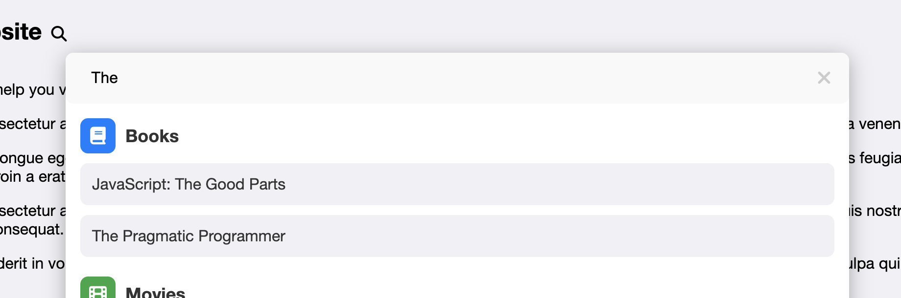

# 🔍 Spotlight Search

The Spotlight Search is a customizable JavaScript module that provides a quick search functionality with a spotlight-style modal. It supports categories with custom icons and colors, integrates with a data source via AJAX, and allows customization through options and callbacks. The module is built with a focus on flexibility and ease of integration.



## 🚀 Features

- Pure JavaScript and CSS with no dependencies on external libraries or frameworks
- Customizable icons and colors for different categories
- AJAX-based search with debounce for optimized performance
- Keyboard shortcuts to toggle the search modal
- Supports custom callbacks for various stages of the search process
- Gracefully handles errors and provides feedback to the user
- Easily integratable into any web project

## 📦 Installation

1. Clone the repository or download the files.
2. Include the JavaScript and CSS files in your project.

### Files

- `spotlight.js`: The main JavaScript module.
- `spotlight.css`: The accompanying CSS file for styling the modal.

### Example

- `example.html`: A working example of using the module.

## 📚 Usage

### HTML

Add the following HTML to your page where you want the search icon to appear:

```html
<div data-spotlight="true"></div>
```

### JavaScript

Initialize the module with custom options (if needed):

```javascript
import spotlight from './spotlight.js';

spotlight.init({
    url: '/search', // URL to fetch search data (required)
    placeholderText: 'Search here...',
    icons: {
        "books": { class: 'fas fa-book', backgroundColor: '#4CAF50', foregroundColor: '#fff' },
        "movies": { class: 'fas fa-film', backgroundColor: '#FF5722', foregroundColor: '#fff' }
    },
    onItemAdd: (itemData) => `<strong>${itemData.name}</strong>`,
    onFetchSuccess: () => console.log('Fetch successful!'),
    onFetchError: (error) => console.error('Fetch failed:', error),
    debounceDelay: 500
});
```

You can find all the available options and their default value at the top of the `spotlight.js` file.

### CSS

Ensure that the necessary CSS styles are included in spotlight.css or your custom stylesheet to style the modal, input, buttons, and results container.

## 📊 Query Response Format

The module expects the query response from the server to be in the following JSON format:

```json
[
    {
        "type": "category-type",
        "name": "Category Name",
        "items": [
            {
                "name": "Item Name"
            }
        ]
    }
]
```

### Response Fields

- **type**: A string representing the category type (e.g., "books", "movies"). This should match the keys in the `icons` option to apply the correct icon and color.
- **name**: A string representing the name of the category. This is displayed as the section title in the search results.
- **items**: An array of objects where each object represents an item in the category.
  - **name**: A string representing the name of the item. This is displayed as an individual result in the search results.

### Example Response

```json
[
    {
        "type": "books",
        "name": "Books",
        "items": [
            { "name": "JavaScript: The Good Parts" },
            { "name": "Eloquent JavaScript" }
        ]
    },
    {
        "type": "movies",
        "name": "Movies",
        "items": [
            { "name": "Inception" },
            { "name": "The Matrix" }
        ]
    }
]
```

Ensure that the response from your server adheres to this format for proper integration with the Spotlight Search.

## 📜 License

This project is licensed under the MIT License. Feel free to use and modify the code as needed.

## 🤝 Contributing

If you encounter any issues or have suggestions for improvements, feel free to open an issue or submit a pull request.
